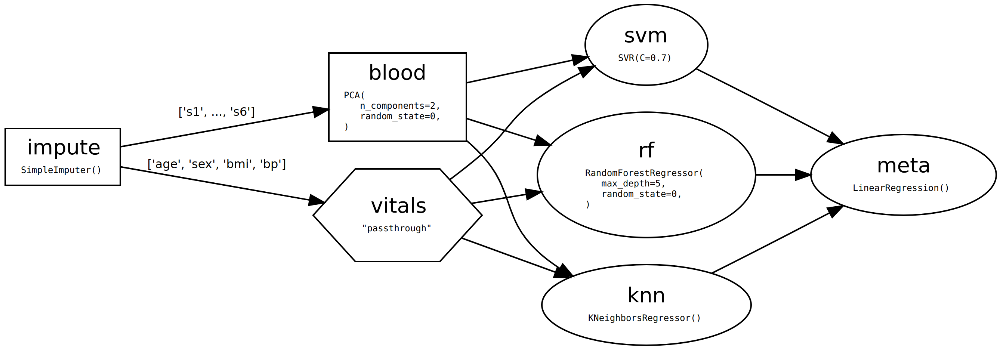

.. -*- mode: rst -*-

|AppVeyor|_ |Codecov|_ |ReadTheDocs|_

.. |AppVeyor| image:: https://ci.appveyor.com/api/projects/status/github/big-o/skdag?branch=main&svg=true
.. _AppVeyor: https://ci.appveyor.com/project/big-o/skdag

.. |Codecov| image:: https://codecov.io/gh/big-o/skdag/branch/main/graph/badge.svg
.. _Codecov: https://codecov.io/gh/big-o/skdag

.. |ReadTheDocs| image:: https://readthedocs.org/projects/skdag/badge/?version=latest
.. _ReadTheDocs: https://skdag.readthedocs.io/en/latest/?badge=latest

skdag - A more flexible alternative to scikit-learn Pipelines
=============================================================

scikit-dag (``skdag``) is an open-sourced, MIT-licenced library that provides advanced
workflow management to any machine learning operations that follow
scikit-learn_ conventions. Installation is simple:

.. code-block:: bash

    pip install skdag

It works by introducing Directed Acyclic Graphs as a drop-in replacement for traditional
scikit-learn ``Pipeline``. This gives you a simple interface for a range of use cases
including complex pre-processing, model stacking and benchmarking.

.. code-block:: python

   from skdag import DAGBuilder

   dag = (
      DAGBuilder()
      .add_step("impute", SimpleImputer())
      .add_step("vitals", "passthrough", deps={"impute": slice(0, 4)})
      .add_step(
         "blood",
         PCA(n_components=2, random_state=0),
         deps={"impute": slice(4, 10)}
      )
      .add_step(
         "rf",
         RandomForestRegressor(max_depth=5, random_state=0),
         deps=["blood", "vitals"]
      )
      .add_step("svm", SVR(C=0.7), deps=["blood", "vitals"])
      .add_step(
         "knn",
         KNeighborsRegressor(n_neighbors=5),
         deps=["blood", "vitals"]
      )
      .add_step("meta", LinearRegression(), deps=["rf", "svm", "knn"])
      .make_dag(n_jobs=2, verbose=True)
   )

   dag.show(detailed=True)

The above DAG imputes missing values, runs PCA on the columns relating to blood test
results and leaves the other columns as they are. Then they get passed to three
different regressors before being passed onto a final meta-estimator. Because DAGs
(unlike pipelines) allow predictors in the middle or a workflow, you can use them to
implement model stacking. We also chose to run the DAG steps in parallel wherever
possible.

After building our DAG, we can treat it as any other estimator:

.. code-block:: python

   from sklearn import datasets

   X, y = datasets.load_diabetes(return_X_y=True, as_frame=True)
   X_train, X_test, y_train, y_test = train_test_split(
      X, y, test_size=0.2, random_state=0
   )

   dag.fit(X_train, y_train)
   dag.predict(X_test)

Just like a pipeline, you can optimise it with a gridsearch, pickle it etc.

Note that this package does not deal with things like delayed dependencies and
distributed architectures - consider an `established <https://airflow.apache.org/>`_
`solution <https://dagster.io/>`_ for such use cases. ``skdag`` is just for building and
executing local ensembles from estimators.

`Read on <https://skdag.readthedocs.io/>`_ to learn more about ``skdag``...

.. _scikit-learn: https://scikit-learn.org