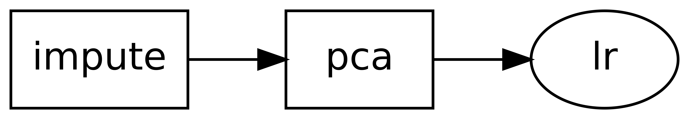
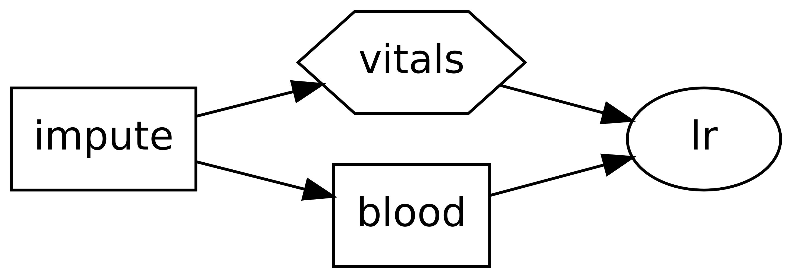

.. _quickstart:

######################
Quick Start with skdag
######################

The following tutorial shows you how to write some simple directed acyclic graphs (DAGs)
with ``skdag``.

Installation
============

Installing skdag is simple:

.. code:: bash

    pip install skdag

Note that to visualise graphs you need to install the graphviz libraries too. See the
`pygraphviz documentation <https://pygraphviz.github.io/>`_ for installation guidance.

Creating a DAG
==============

The simplest DAGs are just a chain of singular dependencies. These DAGs may be
created from the :meth:`skdag.dag.DAG.from_pipeline` method in the same way as a
DAG:

>>> from sklearn.decomposition import PCA
>>> from sklearn.impute import SimpleImputer
>>> from sklearn.linear_model import LogisticRegression
>>> dag = DAG.from_pipeline(
...     steps=[
...         ("impute", SimpleImputer()),
...         ("pca", PCA()),
...         ("lr", LogisticRegression())
...     ]
... )
>>> dag.draw()
o    impute
|
o    pca
|
o    lr
<BLANKLINE>

For more complex DAGs, it is recommended to use a :class:`skdag.dag.DAGBuilder`,
which allows you to define the graph by specifying the dependencies of each new
estimator:

.. code-block:: python

    >>> from skdag import DAGBuilder
    >>> dag = (
    ...     DAGBuilder(infer_dataframe=True)
    ...     .add_step("impute", SimpleImputer())
    ...     .add_step("vitals", "passthrough", deps={"impute": ["age", "sex", "bmi", "bp"]})
    ...     .add_step("blood", PCA(n_components=2, random_state=0), deps={"impute": slice(4, 10)})
    ...     .add_step("lr", LogisticRegression(random_state=0), deps=["blood", "vitals"])
    ...     .make_dag()
    ... )
    >>> dag.draw()
    o    impute
    |\
    o o    blood,vitals
    |/
    o    lr
    <BLANKLINE>

In the above examples we pass the first four columns directly to a regressor, but
the remaining columns have dimensionality reduction applied first before being
passed to the same regressor as extra input columns.

In this DAG, as well as using the ``deps`` option to control which estimators feed in to
other estimators, but which columns are used (and ignored) by each step. For more detail
on how to control this behaviour, see the `User Guide <user_guide.html>`_.

The DAG may now be used as an estimator in its own right:

>>> from sklearn import datasets
>>> X, y = datasets.load_diabetes(return_X_y=True)
>>> dag.fit_predict(X, y)
array([...

In an extension to the scikit-learn estimator interface, DAGs also support multiple
inputs and multiple outputs. Let's say we want to compare two different classifiers:

>>> from sklearn.ensemble import RandomForestClassifier
>>> cal = DAG.from_pipeline(
...     [("rf", RandomForestClassifier(random_state=0))]
... )
>>> dag2 = dag.join(cal, edges=[("blood", "rf"), ("vitals", "rf")])
>>> dag2.draw()
o    impute
|\
o o    blood,vitals
|x|
o o    lr,rf
<BLANKLINE>

.. image:: _static/img/dag3.png

Now our DAG will return two outputs: one from each classifier. Multiple outputs are
returned as a :class:`sklearn.utils.Bunch<Bunch>`:

>>> y_pred = dag2.fit_predict(X, y)
>>> y_pred.lr
array([...
>>> y_pred.rf
array([...

Similarly, multiple inputs are also acceptable and inputs can be provided by
specifying ``X`` and ``y`` as ``dict``-like objects.