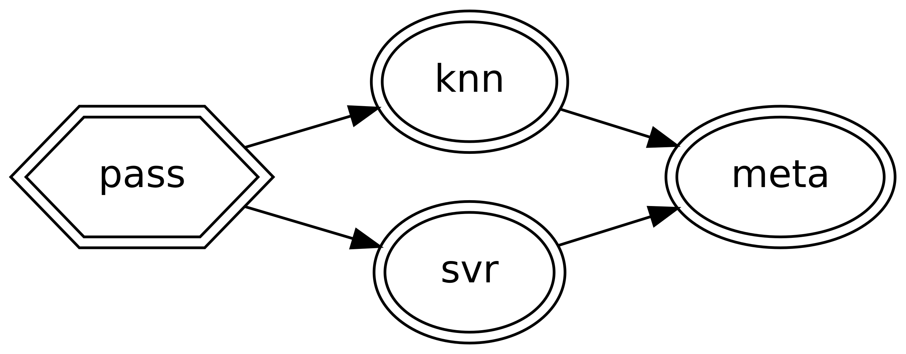

.. title:: User guide : contents

.. _user_guide:

########################
Composing Estimator DAGs
########################

The following tutorial shows you how to write some simple directed acyclic graphs (DAGs)
with ``skdag``.

Creating your first DAG
=======================

The simplest DAGs are just a chain of singular dependencies, which is equivalent to a
scikit-learn :class:`~sklearn.pipeline.Pipeline`. These DAGs may be created from the
:meth:`~skdag.DAG.dag._dag.from_pipeline` method in the same way as a DAG:

.. code-block:: python

    >>> from sklearn.decomposition import PCA
    >>> from sklearn.impute import SimpleImputer
    >>> from sklearn.linear_model import LogisticRegression
    >>> dag = DAG.from_pipeline(
    ...     steps=[
    ...         ("impute", SimpleImputer()),
    ...         ("pca", PCA()),
    ...         ("lr", LogisticRegression())
    ...     ]
    ... )

You may view a diagram of the DAG with the :meth:`~skdag.dag.DAG.show` method. In a
notbook environment this will display an image, whereas in a terminal it will generate
ASCII text:

.. code-block:: python

    >>> dag.show()
    o    impute
    |
    o    pca
    |
    o    lr

.. image:: _static/img/dag1.png

For more complex DAGs, it is recommended to use a :class:`skdag.dag.DAGBuilder`,
which allows you to define the graph by specifying the dependencies of each new
estimator:

.. code-block:: python

    >>> from skdag import DAGBuilder
    >>> dag = (
    ...     DAGBuilder()
    ...     .add_step("impute", SimpleImputer())
    ...     .add_step("vitals", "passthrough", deps={"impute": slice(0, 4)})
    ...     .add_step("blood", PCA(n_components=2, random_state=0), deps={"impute": slice(4, 10)})
    ...     .add_step("lr", LogisticRegression(random_state=0), deps=["blood", "vitals"])
    ...     .make_dag()
    ... )
    >>> dag.show()
    o    impute
    |\
    o o    blood,vitals
    |/
    o    lr

.. image:: _static/img/dag2.png

In the above examples we pass the first four columns directly to a regressor, but
the remaining columns have dimensionality reduction applied first before being
passed to the same regressor. Note that we can define our graph edges in two
different ways: as a dict (if we need to select only certain columns from the source
node) or as a simple list (if we want to simply grab all columns from all input
nodes).

The DAG may now be used as an estimator in its own right:

.. code-block:: python

    >>> from sklearn import datasets
    >>> X, y = datasets.load_diabetes(return_X_y=True)
    >>> dag.fit_predict(X, y)
    array([...

In an extension to the scikit-learn estimator interface, DAGs also support multiple
inputs and multiple outputs. Let's say we want to compare two different classifiers:

.. code-block:: python

    >>> from sklearn.ensemble import RandomForestClassifier
    >>> rf = DAG.from_pipeline(
    ...     [("rf", RandomForestClassifier(random_state=0))]
    ... )
    >>> dag2 = dag.join(rf, edges=[("blood", "rf"), ("vitals", "rf")])
    >>> dag2.show()
    o    impute
    |\
    o o    blood,vitals
    |x|
    o o    lr,rf

.. image:: _static/img/dag3.png

Now our DAG will return two outputs: one from each classifier. Multiple outputs are
returned as a :class:`sklearn.utils.Bunch<Bunch>`:

.. code-block:: python

    >>> y_pred = dag2.fit_predict(X, y)
    >>> y_pred.lr
    array([...
    >>> y_pred.rf
    array([...

Similarly, multiple inputs are also acceptable and inputs can be provided by
specifying ``X`` and ``y`` as ``dict``-like objects.

########
Stacking
########

Unlike Pipelines, DAGs do not require only the final step to be an estimator. This
allows DAGs to be used for model stacking.

Stacking is an ensemble method, like bagging or boosting, that allows multiple models
to be combined into a single, more robust estimator. In stacking, predictions from
multiple models are passed to a final `meta-estimator`; a simple model that combines the
previous predictions into a final output. Like other ensemble methods, stacking can help
to improve the performance and robustness of individual models.

``skdag`` implements stacking in a simple way. If an estimator without a ``transform()``
method is placed in a non-leaf step of the DAG, then the output of
:meth:`predict_proba`, :meth:`decision_function` or :meth:`predict` will be passed to
the next step(s).

.. code-block:: python

    >>> from sklearn import datasets
    >>> from sklearn.linear_model import LinearRegression
    >>> from sklearn.model_selection import train_test_split
    >>> from sklearn.neighbors import KNeighborsRegressor
    >>> from sklearn.svm import SVR
    >>> X, y = datasets.load_diabetes(return_X_y=True)
    >>> X_train, X_test, y_train, y_test = train_test_split(
    ...     X, y, test_size=0.2, random_state=0
    ... )
    >>> knn = KNeighborsRegressor(3)
    >>> svr = SVR(C=1.0)
    >>> stack = (
    ...     DAGBuilder()
    ...     .add_step("pass", "passthrough")
    ...     .add_step("knn", knn, deps=["pass"])
    ...     .add_step("svr", svr, deps=["pass"])
    ...     .add_step("meta", LinearRegression(), deps=["knn", "svr"])
    ...     .make_dag()
    ... )
    >>> stack.fit(X_train, y_train)

Note that the passthrough is not strictly necessary but it is convenient as it ensures
the stack has a single entry point, which makes it simpler to use.

The DAG infers that :meth:`predict` should be called for the two intermediate
estimators. Our meta-estimator is then simply taking in prediction for each classifier
as its input features.

As we can now see, the stacking ensemble method gives us a boost in performance:

.. code-block:: python

    >>> stack.score(X_test, y_test)
    0.145...
    >>> knn.score(X_test, y_test)
    0.138...
    >>> svr.score(X_test, y_test)
    0.128...

Note that for binary classifiers you probably need to specify that only the positive
class probability is used as input by the meta-estimator. The DAG will automatically
infer that :meth:`predict_proba` should be called, but you will need to manually tell
the DAG which column to take. To do this, you can simply specify your step dependencies
as a dictionary of step name to column indices instead:

.. code:: python

    >>> from sklearn.ensemble import RandomForestClassifier
    >>> from sklearn.svm import SVC
    >>> clf_stack = (
    ...     DAGBuilder()
    ...     .add_step("pass", "passthrough")
    ...     .add_step("rf", RandomForestClassifier(), deps=["pass"])
    ...     .add_step("svr", SVC(), deps=["pass"])
    ...     .add_step("meta", LinearRegression(), deps={"rf": 1, "svc": 1}])
    ...     .make_dag()
    ... )

Stacking works best when a diverse range of algorithms are used to provide predictions,
which are then fed into a very simple meta-estimator. To minimize overfitting,
cross-validation should be considered when using stacking.